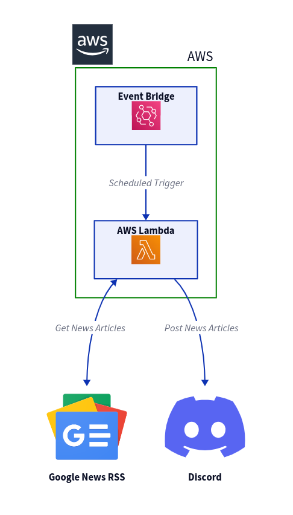

  

# Discord Bot Lambda

A Discord Bot(webhook) written in Go and hosted as an AWS Lambda Function. This application is designed to call the Google News RSS feed and post latest news articles to the discord bot based on given search query. We can automate the daily articles posting by setting up AWS EventBridge to schedule event triggers targetting the lambda function.

## Reference Diagram:



## Reference Links:

Install go from the official website - [link](https://go.dev/dl/).

AWS Lambda Documentation for Golang - [link](https://docs.aws.amazon.com/lambda/latest/dg/lambda-golang.html).

Google News RSS Feed usage blog - [link](https://newscatcherapi.com/blog/google-news-rss-search-parameters-the-missing-documentaiton).

Create your Discord Bot - [link](https://support.discord.com/hc/en-us/articles/360045093012).

Discord Webhook Documentation - [link](https://discord.com/developers/docs/resources/webhook).

## Build

Build, Compile and Zip with the following command.

```GOARCH=amd64 GOOS=linux CGO_ENABLED=0 go build -tags lambda.norpc -o bootstrap main.go```

```zip myFunction.zip bootstrap```

## Usage

Upload the Zip file to AWS Lambda Function.

Create an AWS EventBridge schedule event to trigger the lambda function - [link](https://docs.aws.amazon.com/eventbridge/latest/userguide/eb-run-lambda-schedule.html)

## Contributors

- [gokg4](https://github.com/gokg4) - creator and maintainer
